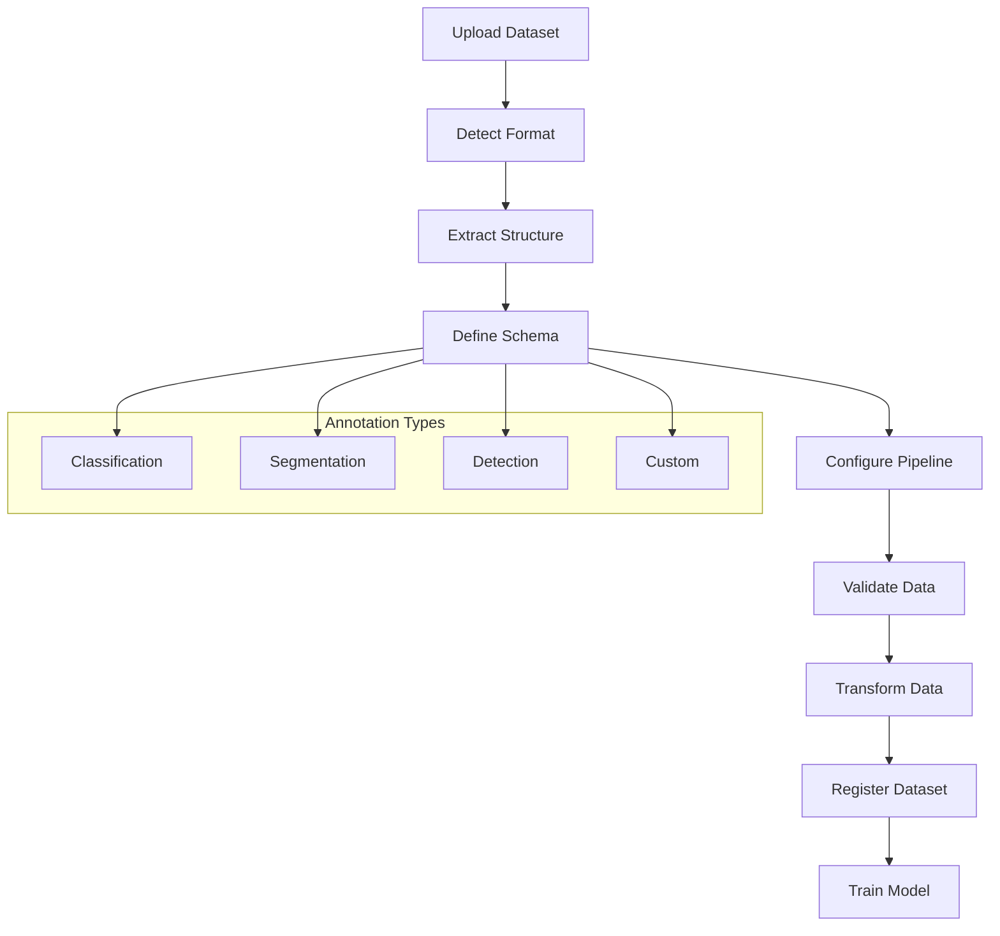

# Custom Dataset Management System Design

## 🎯 Cel Systemu
Umożliwienie użytkownikom:
1. Ładowanie własnych datasetów w różnych formatach
2. Definiowanie niestandardowych systemów adnotacji
3. Wizualne zarządzanie przepływami pracy z danymi
4. Automatyczne walidowanie i konwersje formatów

## 🏗️ Architektura Systemu

### 1. Dataset Pipeline Flow
```
📁 Raw Dataset Upload
    ↓
🔍 Format Detection & Validation
    ↓
📋 Annotation Schema Definition
    ↓
🔄 Data Transformation Pipeline
    ↓
✅ Dataset Registration
    ↓
🧠 Model Training Integration
```

### 2. Komponenty Główne

#### A. Dataset Uploader
- Obsługa wielu formatów (ZIP, TAR, CSV, JSON, DICOM, PNG/JPG)
- Automatyczna detekcja struktury katalogów
- Walidacja integralności danych
- Podgląd próbek danych

#### B. Annotation Schema Designer
- Visual builder dla schematów adnotacji
- Obsługa typów: classification, segmentation, detection, custom
- Definicja klas i etykiet
- Walidacja spójności adnotacji

#### C. Data Pipeline Orchestrator
- Graf przepływu danych z wizualnym edytorem
- Transformacje danych (resize, normalizacja, augmentacja)
- Walidatory jakości danych
- Monitorowanie procesów

#### D. Dataset Registry
- Katalog wszystkich datasetów
- Wersjonowanie datasetów
- Metadane i statystyki
- Kontrola dostępu

## 🔧 Implementacja Techniczna

### Backend Components:
1. **DatasetManager** - Główny orkiestrator
2. **AnnotationSchemaEngine** - Silnik schematów
3. **PipelineExecutor** - Wykonawca przepływów
4. **DataValidator** - Walidator danych
5. **FormatConverter** - Konwerter formatów

### Frontend Components:
1. **Dataset Upload Wizard** - Kreator uploadu
2. **Schema Designer** - Projektant schematów
3. **Pipeline Editor** - Edytor przepływów (graf)
4. **Dataset Browser** - Przeglądarka datasetów
5. **Validation Dashboard** - Panel walidacji

## 📊 Flow Diagram


## 🎨 UI/UX Design Patterns

### 1. Upload Wizard (Multi-step)
- Step 1: File Selection & Upload
- Step 2: Structure Preview
- Step 3: Schema Definition
- Step 4: Pipeline Configuration
- Step 5: Validation & Registration

### 2. Visual Pipeline Editor
- Drag & drop komponenty
- Węzły: Input, Transform, Validate, Output
- Krawędzie: Data flow connections
- Real-time preview

### 3. Schema Designer
- Form builder interface
- Field types: text, number, enum, bbox, polygon
- Conditional fields
- Preview mode

## 📁 File Structure
```
apps/
├── dataset_manager/
│   ├── models/
│   │   ├── dataset.py
│   │   ├── annotation_schema.py
│   │   └── pipeline.py
│   ├── views/
│   │   ├── upload_views.py
│   │   ├── schema_views.py
│   │   └── pipeline_views.py
│   ├── serializers/
│   ├── validators/
│   └── utils/
├── static/dataset_manager/
│   ├── js/
│   │   ├── upload-wizard.js
│   │   ├── schema-designer.js
│   │   ├── pipeline-editor.js
│   │   └── dataset-browser.js
│   └── css/
└── templates/dataset_manager/
```

## 🔄 Integration Points
- MLflow artifacts integration
- Existing model training pipeline
- Current dataset preview system
- User authentication system
